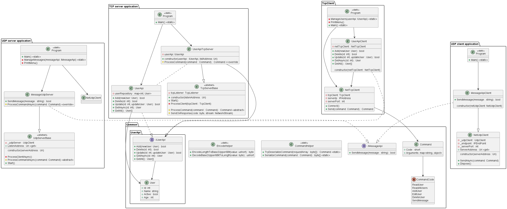

# АСВТ (Занятие 5). Сетевые приложения. TCP и UDP серверы.

## Цель

Разработка клиент-серверные приложений на языке программирования C# на основе протокола TCP и UDP.

Пример приложений:

* TCP Сервер - Слушает TCP-сокет на порту и ждёт команды от клиента, управляет пользователями:
    * Создание пользователя
    * Удаление пользователя
    * Редактирование пользователя
    * Получение пользователя по уникальному ключу
    * Получение списка пользователей
* TCP клиент - подключается к серверу в TCP-сокет на порту и отправляет команды, управляет пользователями и выводит результаты
* UDP Сервер - Слушает UDP-сокет на порту и ждёт команды от клиента, получает текстовые сообщения:
    * Получение текстового сообщения
* UDP клиент - подключается к серверу в UDP-сокет на порту и отправляет текстовое сообщение

## Задача

Модифицировать приложения TCP и UDP клиент-сервера, чтобы приложения
TCP клиент-сервера управляли не пользователями, а чем-нибудь другим (например кассой, погодой или ещё, придумать своё). Приложения UDP клиент-сервера должны отправлять не текстовые сообщения, а какой-нибудь другой вид сообщения (Своя реализация сообщения JSON).

TCP приложения (клиент и сервер):

```
+------------+    команда { Code: x, Arguments: ... }  +------------+
| TCP-клиент | --------------------------------------> | TCP-сервер |
+------------+ <-------------------------------------  +------------+
                  ответ { Code: x, Arguments: ... }
```

UDP приложения (клиент и сервер):

```
+------------+    команда { Code: x, Arguments: ... }  +------------+
| UDP-клиент | --------------------------------------> | UDP-сервер |
+------------+                                         +------------+
```

## Двоичный формат сообщений

Обмен сообщениями между клиентом и сервером, а также обратно
производится в двоичном виде (массив байт, в котором закодирована команда и JSON сообщение в BASE64 представлении), сообщение устроено следующем образом:

```
[0x01, C, L, 0x02, ..., 0x03]
```

, где:

* 0x01 - байт-признак начала сообщения (`SOH`)
* 0x02 - байт-признак начала данных сообщения (`STX`)
* 0x03 - байт-признак конца сообщения (`ETX`)
* C - код сообщения (от 0 до 63), для каждого сообщения свой уникальный код
* L - длина сообщения (значения от 0 до 63) по основанию 2: 2^L
* ... - байты `ASCII`-строки в формате `JSON`, которая закодирована в байты `BASE64`


> Внимание! Так как значения 0x01, 0x02, 0x03 используются в качестве маркеров,
> то младшие 2 бита для байта L не используются:
> `00000100` => `00000001` (2^1 = 2)
> `00010000` => `00000100` (2^4 = 16)

Байты данных являются строкой, которая закодирована в формате BASE64
(только ASCII символы a-z, A-Z, 0-9, =). Данные являются строкой JSON.

Пример структуры сообщения (в виде массива байт):

```
[1, 8, 24, 2, 101, 121, 74, 69, 89, 88, 82, 104, 73, 106, 112, 48, 99, 110, 86, 108, 102, 81, 61, 61, 0, 0, 0, 0, 0, 0, 0, 0, 0, 0, 0, 0, 3]
```

Используя формат `[0x01, C, L, 0x02, ..., 0x03]` имеем:

1. `С` = `8`, где у `8` (`00001000`) отбрасываем `2` младших бита: `0000010` => `2`.
    Реальное значение равно **2**. Код команды 2.
2. `L` = `24`, где у `24` (`00011000`) отбрасываем `2` младших бита: `00000110` => `6`. Возводим 2^6 = 32
    Реальное значение равно **32**. Следовательно, длина данных 32.
3. Считываем 32 байта после байта 0x02. Отбрасываем нули 0x00.
4. Оставшиеся байты представляют строку в формате base64: `eyJEYXRhIjp0cnVlfQ==`
5. Декодируя строку base64 получаем JSON: `{"Code":2,"Arguments":{"Data":true}}`

Кодирование в обратную сторону работает аналогично.

## Структура кода

Структура кода представлена на UML Диаграмме:



### Общая библиотека `Common`

`CommandCode` - Коды команд. (Реализация студента будет иметь отличные коды):
* `ReadUser` - получить пользователя
* `ReadAllUsers` - получить всех пользователей
* `AddUser` - добавить пользоваеля
* `EditUser` - редактировать пользоваеля
* `DeleteUser` - удалить пользоваеля
* `SendMessage` - отправить сообщение

`Command` - Объект команды. Отправляемое и получаемое сообщение. Является ядром обмена сообщениями. Сериализуется в JSON, затем в двоичное сообщение.
* `Code` - код команды
* `Arguments` - дополнительные аргументы команды

`CommandHelper` - вспомогательный класс для сереализции сообщения в двочиное представление и обратно
* `TryDeserializeCommand` - Метод десериализации команды из двоичного представления
* `SerializeCommand` - Метод сериализации команды (сообщения) в двоичное представление

`EncodeHelper` - вспомогательный класс для кодирования и декодирования длины `L`
* `EncodeLengthToBase2Upper6Bit` - кодировать по основанию 2 в 6 бит 
* `DecodeBase2Upper6BitToLength` - декодировать 6 бит в длину по основанию 2

`IMessageApi` - интерфейс отправки текстовых сообщений. (Реализация студента должна иметь другой функционал)
* `SendMessage` - метод отправки текстового сообщения . (Реализация студента должна иметь другой функционал)

`IUserApi` - интерфейс управления пользователями. (Реализация студента должна иметь другой функционал)
* `Add` - Метод добавления пользователя
* `Delete` - Метод удаления пользователя по Id
* `Update` - Метод редактирования пользователя по Id
* `Get` - Метод получения пользователя по Id
* `GetAll` - Метод получения  всех пользователей

`User` - объект пользователя. (Реализация студента должна иметь другой функционал)
* `Id` - Id пользователя 
* `Name` - Имя пользователя
* `Active` - Активирован пользователь?
* `Age` - Возраст пользователя.

### Приложение TCP-сервер `TcpServer`

`TcpServerBase`
* `Start` - Метод запуска TCP сервера
* `ProcessClient` - Метод обработки входящих TCP соединений от клиента
* `ProcessCommand` - Метод обработки распознанной команды от TCP-клиента. Абстрактный метод.
* `SendOkResponse` - отправка усешного ответа

`UserApiTcpServer`
* `ProcessCommand` - обработка распознанной команды от TCP-клиента. В данном случае конкретная реализация управление пользователями.

### Приложение TCP-клиент `TcpClient`

`NetTcpClient` - базовый класс клиента, реализующий работу с TCP-сервером
* `Connect` - подключение к серверу
* `Send` - отправка команды на сервер

`UserApiClient` - клиент отправки команд удалённому TCP-серверу
* `Add` - Метод добавления пользователя на сервере
* `Delete` - Метод удаления пользователя по Id на сервере
* `Update` - Метод редактирования пользователя по Id на сервере
* `Get` - Метод получения пользователя по Id на сервере
* `GetAll` - Метод получения  всех пользователей на сервере

### Приложение Udp-сервер `TcpServer`

`UdpServerBase` - базовый абстрактный класс реализующий функционал  UDP сервера
`ListenAddress` - адрес, который слушает UDP-сервер (сетевой адрес и порт)
`ProcessClientAsync` - обработка входящих запросов от клиента
`ProcessCommandAsync` - Метод обработки команд. Абстрактный метод.
`Start` - Запуск UDP сервераю

`MessageUdpServer` - Реализация UDP сервера, обрабатывает сообщения от клиента. (Реализация студента должна иметь другой функционал. Нужно реализовать свой класс.) 
`SendMessage` - Метод отправки текстовых сообщений
`ProcessCommandAsync` - Метод обработки команд. Конкретная реализауия.